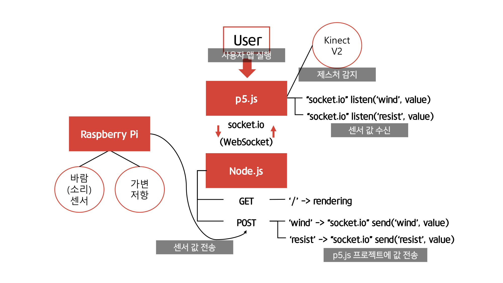

# Totoro's Weather Trip
- 2019-1 "비주얼 프로그래밍"
- 개발기간 : 19년 5월 9일 ~ 19년 6월 20일
- p5.js, Kinect, RaspberryPi, Node.js, socket.io
- **조성동(p5.js, RPI, Server)**, 김형호(p5.js), 유승훈(문서자료 및 리소스), 최환(Kinect, RPI, 3D printing)
- [함께 사용되는 라즈베리파이 프로젝트](https://github.com/sdong001/rpi-weather-media-art)


## 목차
- [Demo](#Demo)
- [프로젝트 목표](#프로젝트-목표)
- [개발현황](#개발현황)
- [설계](#설계)
- [문제해결과정](#문제해결과정)
- [회의록](#회의록)

---

## [Demo](https://totoroweather.run.goorm.io/)
#### 공통
* 구동환경에 따라서 "민들레 홀씨"의 동작이 다를 수 있습니다.
* 오른쪽 상단에 BGM, 지역(광진구), 비, 눈 모드 등을 설정할 수 있는 컨트롤이 위치함

#### (Only) p5.js
* 키보드 좌/우 press => 이전/다음 날짜 이동
* 키보드 상/하 press => 이전/다음 도시 이동
* 마우스 휠 버튼 press => 민들레 홀씨에 약간의 바람 불어넣기 (여러번 눌러 날릴 수 있음)
#### p5.js + RPI + Kinect V2
* 키넥트 좌/우 제스처 => 이전/다음 날짜 이동
* 키넥트 정지한 채 손 회전하기 => 민들레 홀씨 원래대로 되돌리기
* 라즈베리파이 가변저항 회전 => 가고자 하는 도시 이동
* 라즈베리파이 바람센서 => 민들레 홀씨에 바람 불기

---

## 프로젝트 목표

* 토토로 캐릭터와 p5.js를 활용한 날씨 정보의 시각적 효과
* 키넥트를 통한 모션 인식, 라즈베리파이/센서를 활용한 사용자와 상호작용

---

## 설계



---

## 문제해결과정

* p5.js
  * 이미지를 이용하여 캐릭터와 배경 등 오브젝트를 그릴 경우에는 리소스 사용이 많아 성능 저하
    * 보여주고자 하는 이미지의 윤곽선의 vertex들을 json 파일에 저장 후에 beginShape, endShape 레퍼런스를 이용하여 그 안을 칠하는 형식으로 수정하여 성능 향상
* Kinect
  * 기본으로 제공하는 레퍼런스를 제외하고 구현하고자 하는 “손을 회전, 좌/우로 이동하는 동작”을 제공하지 않음
    * 회전하는 동작은 손바닥 joint를 기준으로 엄지 joint의 위치를  확인해 해결
    * 좌/우로 이동하는 동작은 팔꿈치 joint를 기준으로 손바닥의 joint 위치를 검사해 해결

* Raspberry Pi
  * Arduino와 다르게 아날로그 신호를 처리하지 못하여 센서값 측정 불가
    * ADC(아날로그 디지털 컨버터)를 지원하는 MCP3008 chip을 이용하여 아날로그 신호를 디지털로 변환하여 처리
  * p5.js, kinect, 센서값 측정을 동시에 처리하는데 성능이 떨어짐
    * 센서값은 Raspberry Pi에서 처리하고 p5.js, Kinect는 PC에서 처리
    * 서버를 구축하고 웹소켓을 이용해 센서값을 주고 받도록 설계 변경
---

## 개발현황
#### <a href="https://trello.com/b/iE9JH2v1" target="_blank">👉 Trello</a>

---

## 회의록

## 190502 - 브레인스토밍 및 개발환경 구축
```
[회의내용]
- 프로젝트 주제 토의
 * 강의 때 배운 내용을 토대로 공공데이터와 p5.js를 활용해보자
 * 날씨 데이터가 실용적이며 시각화할 요소가 많음
 * 텍스트 형태로 날씨 정보를 알려주기보다 시각화를 해보자
 * 미디어 아트 형태로 캐릭터를 활용한 풍경에 날씨 데이터를 간접적으로 보여주는건 어떨까?

[향후계획]
- 날씨 API 조사
- 유사 콘텐츠 조사
- 활용할 캐릭터 연구
```

## 190509 - p5.js 시각화 요소
```
[회의내용]
- 시각화 방법에 대한 토의
  * 대중적인 토토로 캐릭터를 활용
  * 비와 눈, 구름은 그대로 표현하되 구름은 그 날의 구름 양에 따라 설정
  * 온도는 토토로 털의 색깔로 표현
  * 미세먼지 농도에 따라 토토로 마스크 착용 유무
  * 민들레로 풍속을 표현

[향후계획]
- 각 요소에 대한 자세한 시각화 방법 고민 및 분담
  (김형호:캐릭터, 구름, 민들레, 조성동: 비, 눈)

```

## 190516 - 사용자 인터렉션
```
[회의내용]
- 교수님께 "사용자와 상호작용할 수 있는 요소를 넣었으면 좋겠다"는 피드백을 받음.
- 웹에서는 키보드나 마우스 입력으로 한정되어 있음
- 제스처 인식이나 센서를 이용한 입력은 어떨까?

[향후계획]
- 제스처 관련 장비 및 레퍼런스 조사
- 센서 관련 조사

```

## 190523 - RPI(라즈베리파이) 센서와 모형
```
[회의내용]
- 라즈베리파이를 이용한 센싱을 어떻게 구성할지?
- 민들레를 사용자가 바람을 불었을 때 날아가게 하는건 어떨까? 이를 시각적으로 잘 표현해줄 민들레나 바람개비 모형이 필요할 듯
- 가변저항으로 구성한 버튼을 돌리는 동작으로 다른 시간 또는 지역의 날씨를 볼 수 있게 해보자.
- 라즈베리파이는 아날로그 신호를 입력받지 못하기 때문에 이를 지원해줄 모듈이 별도로 필요함

[향후계획]
- RPI에서 아날로그 데이터 read를 지원해줄 모듈 조사 (MCP3008)
```

## 190530 - 키넥트 제스처 연구
```
[회의내용]
- 어떤 제스처를 넣고 활용할지?
- 이전 날의 날씨, 다음 날의 날씨를 볼 수 있는 손 동작
- 돌리는 동작으로 시간대를 조정할 수 있는 동작

[향후계획]
- 왼쪽, 오른쪽 손동작의 레퍼런스 연구
- 돌리는 동작은 레퍼런스가 없는데 이를 인식할 수 있는 알고리즘 연구

```

## 190613 - 보완, 프로젝트 마무리
```
[회의내용]
- 바람을 인식할 수 있는 센서를 모형에 넣고 이를 배치할 3D프린팅 제작 토의
- 키넥트, 라즈베리파이, p5.js 통합 토의

[향후계획]
- 통합하여 테스트하고 QA진행
```

## 190619 - 지역연계로 할 수 있는 방안 토의
```
[회의내용]
- 지역과 연계하는 목적의 새로운 버전을 만든다면?
- 지역의 상징물들을 캐릭터로 만들어 넣고, 날씨를 그 지역을 기준으로 보여줌

[향후계획]
- 광진구의 '광이', '진이' 캐릭터와 그 지역의 
```
